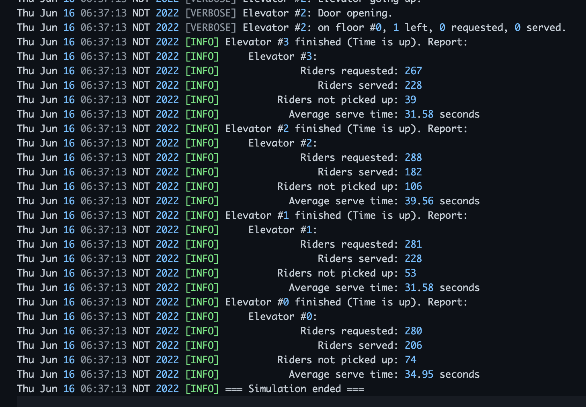
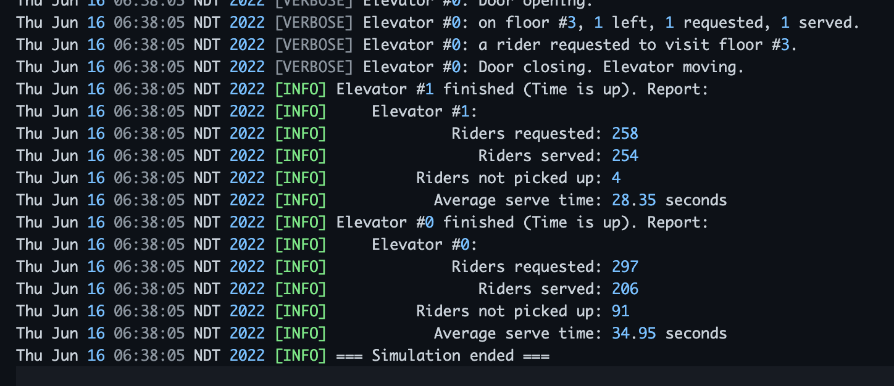

# Elevator Simulation

Student: Zhen Guan (202191382)

## Abbreviations

- **Outside Request**: The request made by a person outside the elevator.
- **Inside Request**: The request made by a person inside the elevator.

## Algorithm

SCAN

## Small Elevator
- Number of floors: 5
- Number of elevators: 4
- Capacity of each: 1
- Simulation time: 7200 sec
- Simulation speed: 1000x

Simulation Result: `small_elevator.log`.

## Large Elevator
- Number of floors: 5
- Number of elevators: 2
- Capacity of each: 2
- Simulation time: 7200 sec
- Simulation speed: 1000x

Simulation Result: `large_elevator.log`.

## Configurable Parameters

- Number of floors
- Number of elevators
- Elevator capacity
- Simulation time
- Simulation speed (For example, 1000x means 1 real-time milliseconds equals to 1 simulation-time second)
- Time needed to move up to the next floor
- Time needed to move down to the next floor
- Time needed to open the door
- Time needed to close the door
- Time needed to wait for passengers to board
- Random passengers generation function (Define how to generate random passengers)
- Random outside request rate function (Define between how many seconds a outside request will be generated)

## Abort Mechanism

If an elavator is trying to do one of the following, before it could happen, the system will abort:

- Move with door open
- Open door while moving

This mechanism is for additional security. The program will not try these behaviors.

---

## How random requests are generated?

### Outside Requests

For each 20~120 seconds, two random outside requests are generated, one requesting going up and another going down.

### Inside Requests

Upon someone entering the elevator, a random inside request is generated.

---

## Where does concurrent controls happen?

In 2 places:

- **Multiple elevators compete for an outside request.** I dispatched 10 reentrant locks for 5 floors  (going-up lock and going-down lock for each floor) to implement this.

- **Printing the report.**
